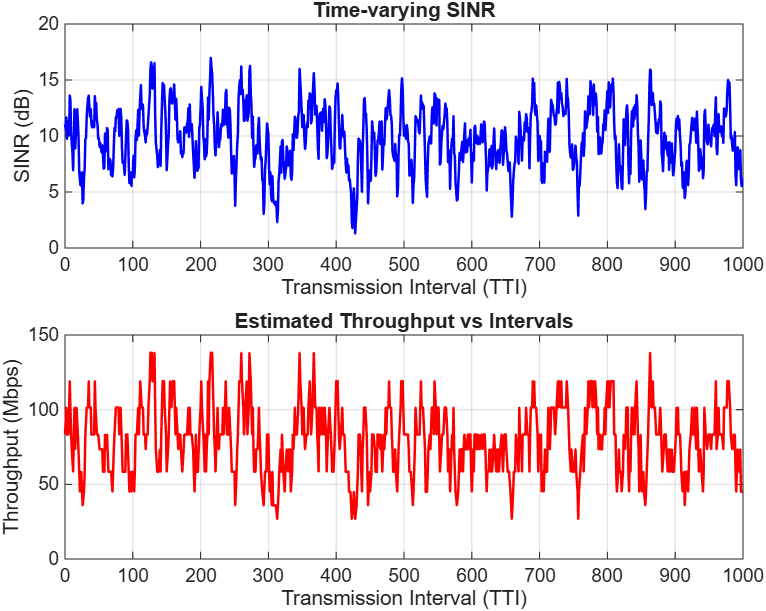

# 5G NR Link Adaptation Simulator

A standalone C++17 application simulating the downlink link-adaptation procedure for a single User Equipment (UE) in a 5G New Radio (NR) network. 

The simulator dynamically maps time-varying Signal-to-Interference-plus-Noise Ratio (SINR) to Channel Quality Indicator (CQI), selects the optimal Modulation and Coding Scheme (MCS), and estimates the achievable physical layer throughput.

## Build and Run Instructions (Linux)

This project uses CMake for cross-platform builds. To compile and run the simulation:

```bash
mkdir build && cd build
cmake ..
make
./link_adaptation
```

## Architectural & Engineering Assumptions

This simulator bridges the gap between **3GPP TS 38.214** specifications and practical RF physics. The following engineering assumptions were implemented:

1. **3GPP Standardization:** The application rigidly utilizes the full standard **NR CQI Table 1** (TS 38.214 Table 5.2.2.1-2) and **NR PDSCH MCS Table 1** (TS 38.214 Table 5.1.3.1-1). Reserved MCS indices (29-31) used for HARQ retransmissions are omitted as this simulator evaluates first-transmission capacity.
2. **Channel Modeling (AR1):** Instead of fully independent random AWGN variations, the channel fading is modeled using a First-Order Auto-Regressive AR(1) process to introduce realistic time-correlation (memory). 
   * SINR(t) = α * SINR(t-1) + (1 - α) * μ + noise
   * We assume α = 0.85 (low-mobility/pedestrian coherence) and a fast-fading noise standard deviation of 1.5 dB.
3. **SINR-to-CQI Mapping (Shannon Bound):** 3GPP does not define a universal numerical SINR-to-CQI table. Instead of using hardcoded empirical thresholds, the minimum required SINR is calculated dynamically based on the Shannon-Hartley theorem. For each CQI's Spectral Efficiency (SE), the required SINR is:
   * SINR_dB = 10 * log10(2^SE - 1) + Δ
   * An implementation margin (Shannon gap) of Δ = 2.0 dB is added to account for real-world 5G receiver imperfections.
4. **CQI-to-MCS Mapping:** CQI and MCS indices are not strictly equivalent. The base station logic scans the MCS table and safely selects the highest available MCS whose spectral efficiency does not exceed the spectral efficiency dictated by the UE's reported CQI.
5. **Throughput Estimation:** Instead of a complex Transport Block Size (TBS) quantization, throughput is mathematically estimated via a spectral-efficiency model assuming a standard 20 MHz channel configuration:
   * **Resource Blocks:** 106
   * **REs per RB:** 144
   * **Spatial Layers:** 1 (SISO)
   * **Slot Duration:** 0.5 ms (30 kHz SCS)

## Simulation Results

Executing the simulation for 1,000 Transmission Time Intervals (TTIs) yields the following metrics, demonstrating the dynamic nature of the link adaptation:

```text
--- Simulation Results (1000 TTIs) ---
Average SINR:       9.85 dB
Average CQI:        9.51
Average MCS:        16.55
Average Throughput: 79.84 Mbps
Min Throughput:     26.77 Mbps
Max Throughput:     138.09 Mbps
-> Per-interval data saved to 'simulation_results.csv'
```

*Note: The maximum throughput of ~138 Mbps reflects a single spatial layer (SISO) over 20 MHz. Scaling this up to 100 MHz bandwidth with 4x4 MIMO would theoretically yield multi-gigabit speeds aligning with 5G commercial claims.*

## Data Visualization

The simulator automatically exports the per-interval data to a `simulation_results.csv` file. Below is the MATLAB visualization of the generated data, showcasing the AR(1) time-correlated fading channel (top) and the resulting quantized throughput adjustments (bottom) as the network switches MCS levels.


